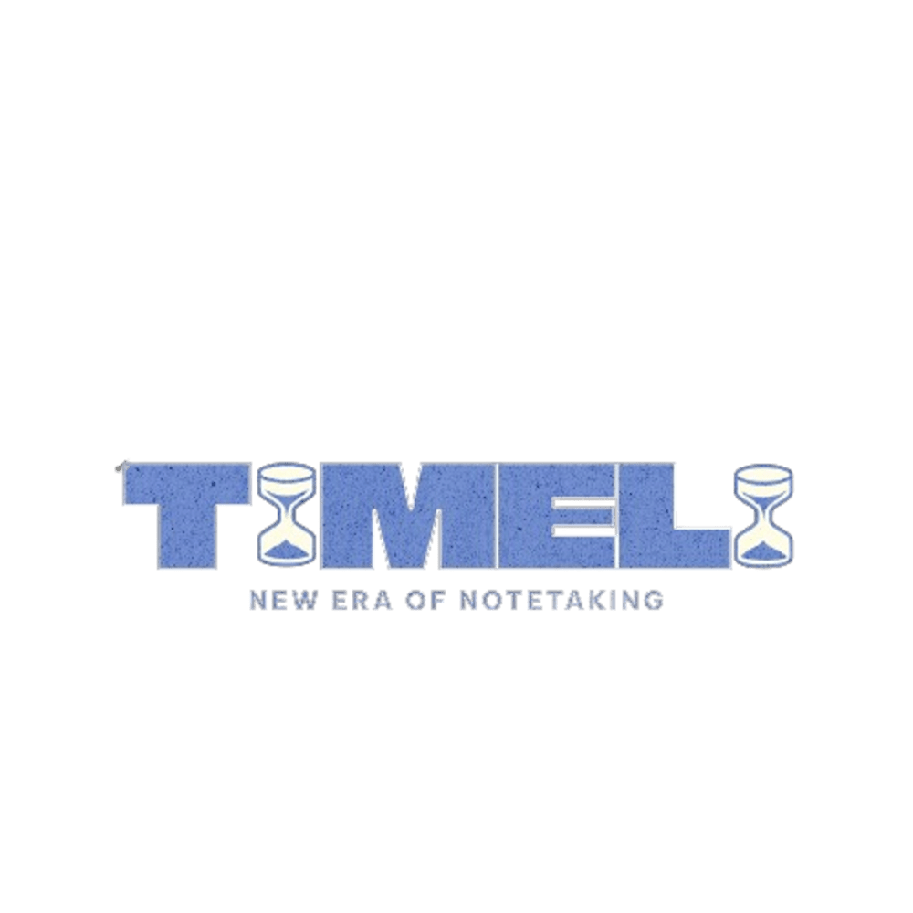

# Timeli

  

    <h1 align="center">TIMELI</h1>

    <em>A New Era Of Note Taking</em>

	
	
	
	

		<em>Developed with the software and tools below.</em>

	

##  Quick Links

> - [ Overview](#-overview)
> - [ Features](#-features)
> - [ Repository Structure](#-repository-structure)
> - [ Modules](#-modules)
> - [ Getting Started](#-getting-started)
>   - [ Installation](#-installation)
>   - [ Running Timeli](#-running-Timeli)
>   - [ Tests](#-tests)
> - [ Project Roadmap](#-project-roadmap)
> - [ Contributing](#-contributing)
> - [ License](#-license)
> - [ Acknowledgments](#-acknowledgments)

---

##  Overview

Timeli is a minimal note taking app inspired by Notion's simple interface. We, the Timeli developers, despise an interface where you are bombarded with features and notifications.
For that reason, everything in Timeli is customizable and minimal. With Timeli, you should do things your way.

---

##  Features

--Features Here--

---

##  Getting Started

Download on App Store(When it comes out)

##  License

This project is protected under the [SELECT-A-LICENSE](https://choosealicense.com/licenses) License. For more details, refer to the [LICENSE](https://choosealicense.com/licenses/) file.

---

##  Acknowledgments

- List any resources, contributors, inspiration, etc. here.

[**Return**](#-quick-links)

---

